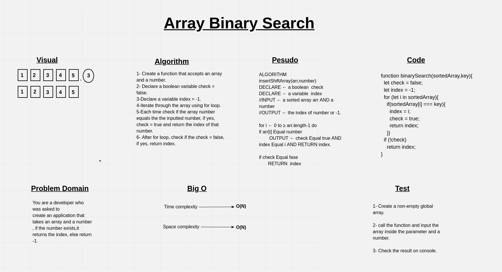

# Binary Search of Sorted Array

Write a function that takes an array and a number and push the number to the middle of the array.

## Whiteboard Process

## Approach & Efficiency

- Time complexity:  O(n).
- Space complexity: O(n).
