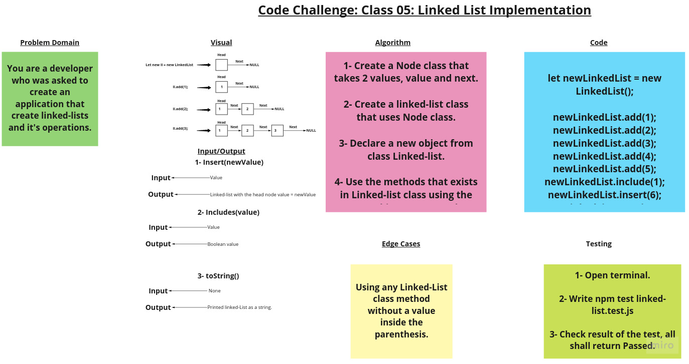

# Singly Linked List

In computer science, a linked list is a linear collection of data elements whose order is not given by their physical placement in memory. Instead, each element points to the next. It is a data structure consisting of a collection of nodes which together represent a sequence. In its most basic form, each node contains: data, and a reference (in other words, a link) to the next node in the sequence. This structure allows for efficient insertion or removal of elements from any position in the sequence during iteration. More complex variants add additional links, allowing more efficient insertion or removal of nodes at arbitrary positions. A drawback of linked lists is that access time is linear (and difficult to pipeline). Faster access, such as random access, is not feasible. Arrays have better cache locality compared to linked lists.

## Challenge

Create a singly linked list class with the following methods:

1. Insert: It shall takes any value as an argument and adds a new node with that value to the head of the list with an O(1) Time performance.

2. Include: It shall takes any value as an argument and returns a boolean result depending on whether that value exists as a Node’s value somewhere within the list.

3. toString: which takes in no arguments and returns a string representing all the values in the Linked List, formatted as:

       "{ a } -> { b } -> { c } -> NULL"

## Approach & Efficiency

BigO:

1. Insert ->  Time: O(1).
              Space: O(1).

2. Include -> Time: O(n).
              Space: O(n).

3. toString -> Time O(n).
               Space: O(n).

## API

1. add(value).
2. addNewHead(value).
3. insert(value).
4. include(value).
5. toString().

## Whiteboard

