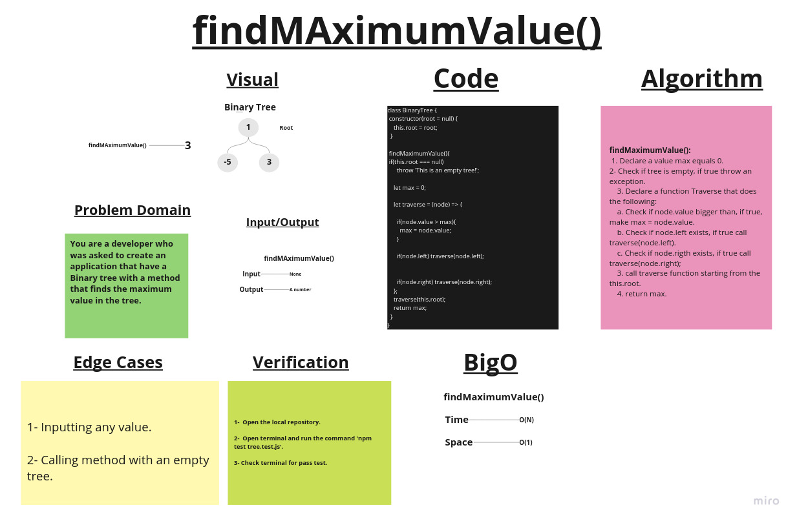

# Binary Trees

A tree is a nonlinear data structure, compared to arrays, linked lists, stacks and queues which are linear data structures. A tree can be empty with no nodes or a tree is a structure consisting of one node called the root and zero or one or more subtrees.

A binary tree is a tree-type non-linear data structure with a maximum of two children for each parent. Every node in a binary tree has a left and right reference along with the data element. The node at the top of the hierarchy of a tree is called the root node.

## Challenge

1- Create a Node class.
2- Create a BinaryTree Class with the following method:

- findMaximumValue();
***Finds the maximum value inside the tree***

## Approach & Efficiency

### BigO:

1. ***findMaximumValue()*** -> Time: O(N).
                               Space: O(1).

## API

- findMaximumValue();
***Finds the maximum value inside the tree***

## Whiteboard

