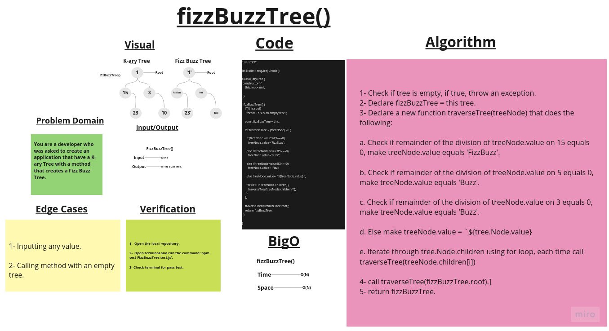

# Fizz Buzz Tree

## Challenge Summary

Create a K-ary tree class that have the following method:

- fizzBuzzTree():

1. If the value is divisible by 3, replace the value with “Fizz”
2. If the value is divisible by 5, replace the value with “Buzz”
3. If the value is divisible by 3 and 5, replace the value with “FizzBuzz”
4. If the value is not divisible by 3 or 5, simply turn the number into a String.

## Whiteboard Process

## Approach & Efficiency

### BigO:

1. ***fizzBuzzTree()*** ->     Time: O(N).
                               Space: O(N)

## Solution

### Example:

        let node1 = new Node(3);
        let node2 = new Node(6);
        let node3 = new Node(15);
        let node4 = new Node(10);
        let node5 = new Node(20);
        let node6 = new Node(30);
        let node7 = new Node(50);
        let node8 = new Node(61);
        let node9 = new Node(19);

        node1.children.push(node2);
        node1.children.push(node3);
        node1.children.push(node4);
        node4.children.push(node5);
        node4.children.push(node6);
        node3.children.push(node7);
        node3.children.push(node8);
        node5.children.push(node9);

        let melon = new K_aryTree();
        melon.root = node1;

        melon.fizzBuzzTree();
