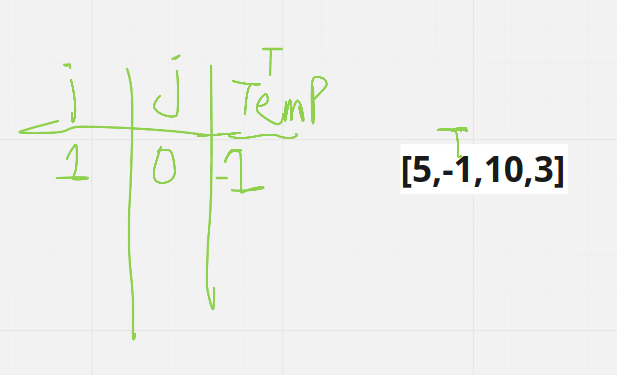
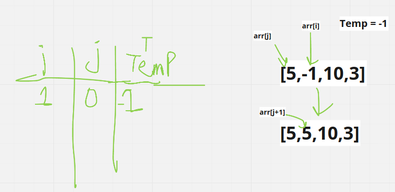
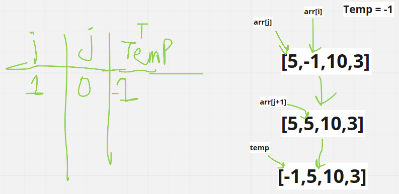

# Insertion Sort

Insertion sort is a simple sorting algorithm that builds the final sorted array one item at a time. It is much less efficient on large lists than more advanced algorithms such as quicksort, heapsort, or merge sort.

## Pseudocode

        InsertionSort(int[] arr)
        
            FOR i = 1 to arr.length
            
            int j <-- i - 1
            int temp <-- arr[i]
            
            WHILE j >= 0 AND temp < arr[j]
                arr[j + 1] <-- arr[j]
                j <-- j - 1
                
            arr[j + 1] <-- temp

## Trace

- Sample array: [5,-1,10,3]

### pass1

1. i will be 1.
2. j will be 0.
3. temp will be a[i], which equal -1.

### pass2

1. Since array of [i] is less than array[j], and j bigger or equal 0, while loop will be true.
2. Array of [j+1] will equal array of [j], replacing -1 with 5.
3. j will equal j-1 , which is now -1, which will make it exit while loop.

### pass3

1. Since j is now -1, while loop wil exit.
2. Replace array of [j+1] with temp, means that array of[0] will become -1.

## Verification

## Efficency

1. Time complexity:   Time:  O(N²).
The basic operation of this algorithm is comparison. This will happen n * (n-1) number of times…concluding the algorithm to be n squared.

2. Space complexity:   Space: O(1).
No additional space is being created. This array is being sorted in place…keeping the space at constant O(1).
