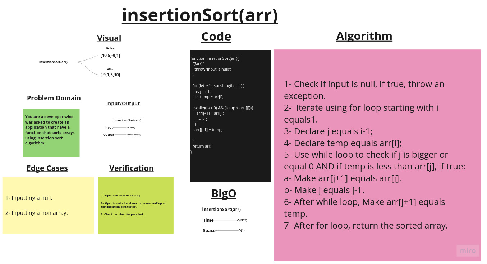

# Insertion sort

## Challenge Summary

Create a function that follows the insertion sort algorithm.

## Whiteboard Process

## Approach & Efficiency

1. ***insertionSort(arr)*** ->     Time:  O(N²).
                                   Space: O(1)

## Solution

### Example:

        let array = [10,18,5,1,-9,3,25];

        console.log(insertionSort(array));
