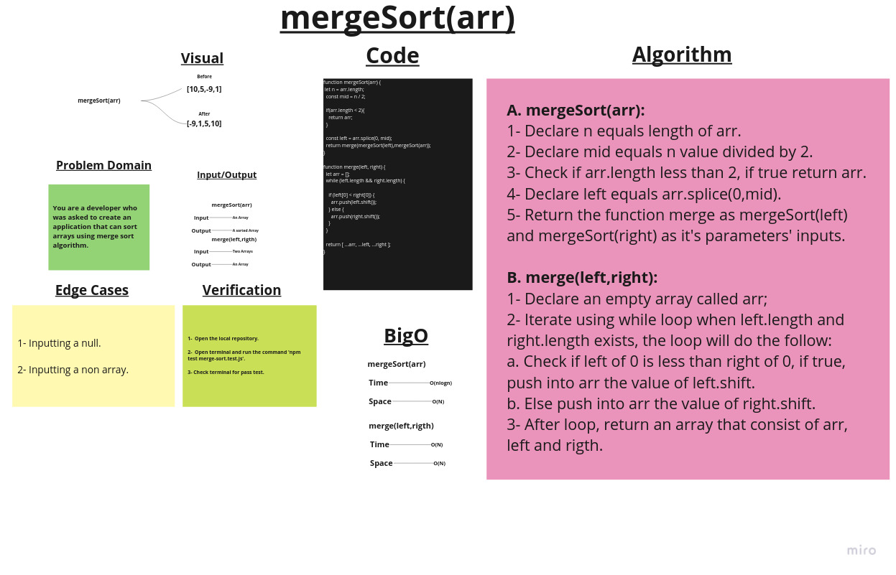

# Merge sort

## Challenge Summary

Create two functions that work together to sort arrays using merge sort algorithm.

## Whiteboard Process

## Approach & Efficiency

1. ***mergeSort(arr)*** ->         Time:  O(nlogn).
                                   Space: O(N).

2. ***merge(left,rigth)*** ->      Time:  O(N).
                                   Space: O(N).

## Solution

### Example:

        let arr = [-5,7,1,-9,25,10];

        console.log(mergeSort(arr));
