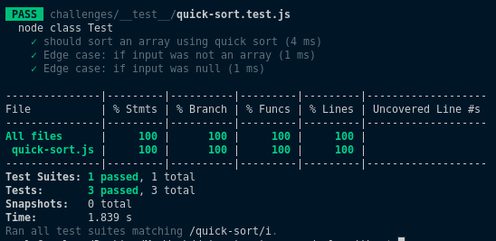

# Quick Sort

Quicksort is an in-place sorting algorithm. Developed by British computer scientist Tony Hoare in 1959 and published in 1961, it is still a commonly used algorithm for sorting. When implemented well, it can be somewhat faster than merge sort and about two or three times faster than heapsort.

## Pseudocode

        ALGORITHM QuickSort(arr, left, right)
            if left < right
                // Partition the array by setting the position of the pivot value 
                DEFINE position <-- Partition(arr, left, right)
                // Sort the left
                QuickSort(arr, left, position - 1)
                // Sort the right
                QuickSort(arr, position + 1, right)

        ALGORITHM Partition(arr, left, right)
            // set a pivot value as a point of reference
            DEFINE pivot <-- arr[right]
            // create a variable to track the largest index of numbers lower than the defined pivot
            DEFINE low <-- left - 1
            for i <- left to right do
                if arr[i] <= pivot
                    low++
                    Swap(arr, i, low)

            // place the value of the pivot location in the middle.
            // all numbers smaller than the pivot are on the left, larger on the right. 
            Swap(arr, right, low + 1)
            // return the pivot index point
            return low + 1

        ALGORITHM Swap(arr, i, low)
            DEFINE temp;
            temp <-- arr[i]
            arr[i] <-- arr[low]
            arr[low] <-- temp

## Trace

- Sample array: [5,3,7,6,2,9]

### pass 1

- Determine a pivot, in this case, its 5.

- Declare 2 pointers, L for left and R for right , same as start and end pointers.

### pass 2

- Since 4,2 are less than pivot, L will keep shifting.
- Since 6 is greater than pivot, L will stop.

### pass 3

- Since 9 are greater than pivot, R will keep shifting.
- Since 3 is less than pivot, R will stop.
- Swap L and R values.

### pass 4

- Move both L and R.
- Since both L and R equals pivot, stop both pointers.
- Keep moving pointers, and so on.

## Verification

## Efficency

1. ***quickSort(arr,start,end)*** ->  Time:  O(nlogn).
                                      Space: O(N).

2. ***pitition(arr,start,end)*** ->   Time:  O(N).
                                      Space: O(1).
