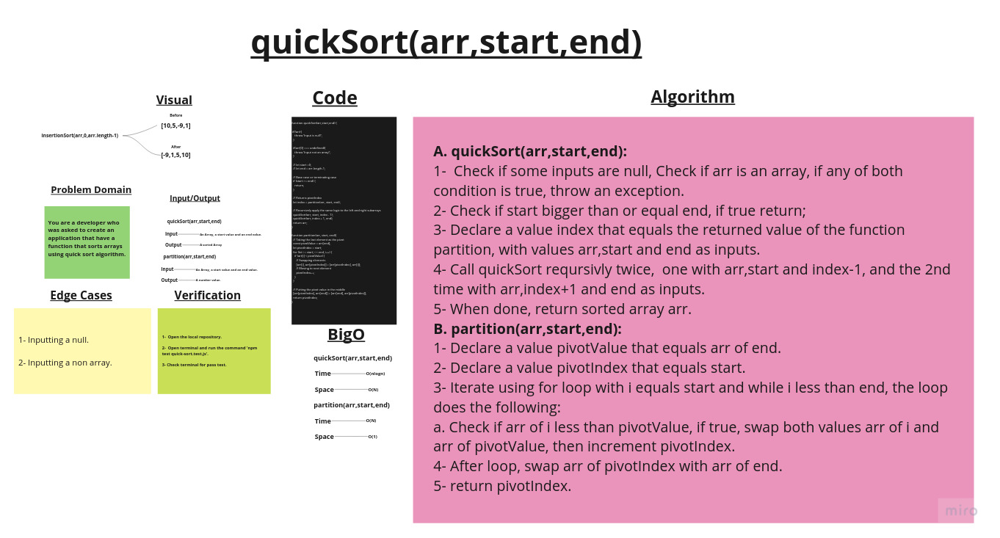

# Quick sort

## Challenge Summary

Create two functions that work together to sort arrays using qucik sort algorithm.

## Whiteboard Process

## Approach & Efficiency

1. ***quickSort(arr,start,end)*** ->  Time:  O(nlogn).
                                      Space: O(N).

2. ***pitition(arr,start,end)*** ->   Time:  O(N).
                                      Space: O(1).

## Solution

### Example:

        let arr = [-5,7,1,-9,25,10];

        console.log(quickSort(arr,0,arr.length - 1));
