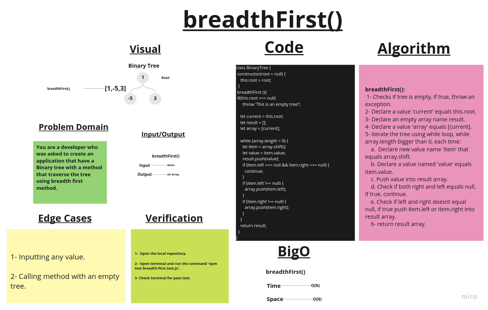

# Challenge Summary

1- Create a Node class.
2- Create a BinaryTree Class with the following method:

- breadthFirst();
***Traverse the tree using breadth first method.***

## Whiteboard Process

## Approach & Efficiency

### BigO:

1. ***breadthFirst()*** ->     Time: O(N).
                               Space: O(N)

## Solution

### Example:

    let one = new Node(1);
    let two = new Node(2);
    let three = new Node(3);
    let four = new Node(4);
    let five = new Node(5);
    let six = new Node(6);
    let seven = new Node(7);
    let eight = new Node(8);
    let nine = new Node(9);

    one.left = two;
    one.right = three;
    two.left = six;
    six.right = seven;
    seven.left = eight;
    seven.right = nine;
    three.left = four;
    three.right = five;
    let melon = new BinaryTree(one);
    console.log(melon.breadthFirst());

