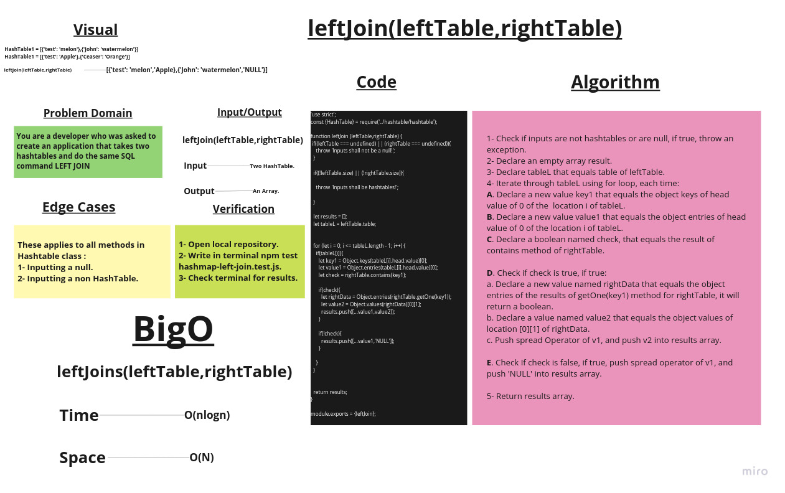

# LEFT JOIN

## Challenge Summary

Create a function that takes two Hash Tables and return an array of keys of left table and values of both tables if right table has the same key, else right table value will equal NULL.

## Whiteboard Process

## Approach & Efficiency

1. ***leftJoin(leftTable,rightTable)*** ->       Time:  O(nlogn).
                                                 Space: O(N).

## Solution

### Example:

                //---------------------------------------------------------------------//

                let leftHashTable = new HashTable(105);

                leftHashTable.add('Pirate_King','Gol D. Roger');
                leftHashTable.add('Straw_Hats','Roronoa Zoro');
                leftHashTable.add('Admiral','Akainu');
                leftHashTable.add('Yonko','Edward Newgate');

                let rightHashTable = new HashTable(105);

                rightHashTable.add('Straw_Hats','Monkey D. Luffy');
                rightHashTable.add('Admiral','Aokiji');
                rightHashTable.add('Yonko','Red-haird Shanks');
                rightHashTable.add('Shichibukai','Dracule Mihawk');

                //---------------------------------------------------------------------//
                leftHashTable.table.forEach((data, i) => {
                console.log(i, data && data.values());
                });

                console.log('-----------------------------------');

                console.log(leftHashTable.table.length);

                console.log('-----------------------------------');

                console.log(rightHashTable.table.length);

                console.log('-----------------------------------');

                rightHashTable.table.forEach((data, i) => {
                console.log(i, data && data.values());
                });
                console.log('|||||||||||||||||||||||||||||||||||||||||||||||||||||');
                console.log(leftJoin(leftHashTable,rightHashTable));
                console.log(leftJoin(rightHashTable,leftHashTable));

                console.log(leftJoin(2,rightHashTable));
                console.log(leftJoin(leftHashTable,'string'));
                console.log(leftJoin(leftHashTable));
                console.log(leftJoin(rightHashTable));
                console.log(leftJoin());
