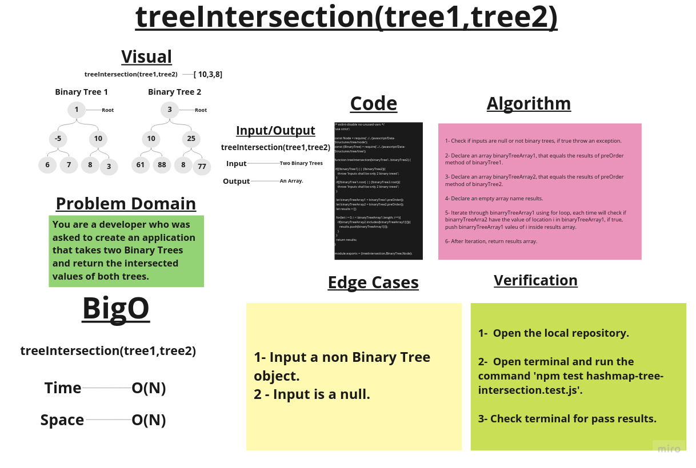

# Tree Intersection

## Challenge Summary

Create a function that takes two Binary trees and return the similar values in both trees.

## Whiteboard Process

## Approach & Efficiency

1. ***treeIntersection(binaryTree1,binaryTree2)*** ->      Time:  O(N).
                                                           Space: O(N).

## Solution

### Example:

        let one = new Node(1);
        let two = new Node(2);
        let three = new Node(3);
        let four = new Node(4);
        let five = new Node(5);
        let six = new Node(6);
        let seven = new Node(7);
        let eight = new Node(8);
        let nine = new Node(9);

        one.left = two;
        one.right = three;
        two.left = six;
        six.right = seven;
        seven.left = eight;
        seven.right = nine;
        three.left = four;
        three.right = five;

        let one1 = new Node(1);
        let two1 = new Node(2);
        let three1 = new Node(13);
        let four1 = new Node(42);
        let five1 = new Node(33);
        let six1 = new Node(5);
        let seven1 = new Node(8);
        let eight1 = new Node(6);
        let nine1 = new Node(91);

        one1.left = two1;
        one1.right = three1;
        two1.left = six1;
        six1.right = seven1;
        seven1.left = eight1;
        seven1.right = nine1;
        three1.left = four1;
        three1.right = five1;

        let melon = new BinaryTree(one);
        let waterMelon = new BinaryTree(one1);

        console.log(treeIntersection(melon,waterMelon));
        console.log(treeIntersection());
