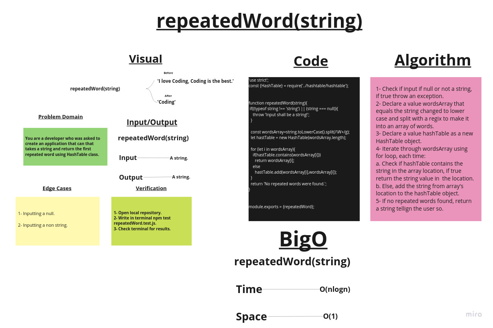

# Repeated word

## Challenge Summary

Create two functions that take a strings and  return the first repeated word using HashTable.

## Whiteboard Process

## Approach & Efficiency

1. ***repeatedWord(string)*** ->      Time:  O(nlogn).
                                      Space: O(1).

## Solution

### Example:

        let str = 'I love coding, coding is the best!';
        let str2 = 'this is boring';

        console.log(repeatedWord(str));
        console.log(repeatedWord(str2));
        console.log(repeatedWord(5));
        console.log(repeatedWord());
