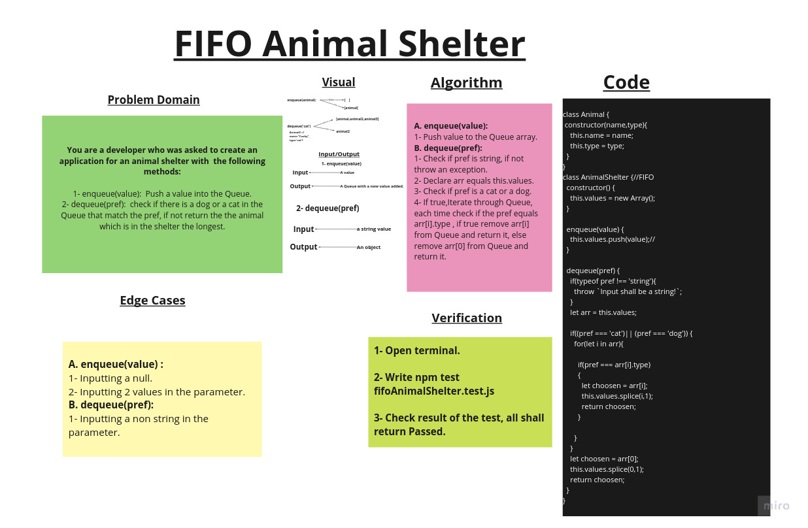

# FIFO Animal Shelter

## Challenge Summary

Implement a first in first out (FIFO) queue named AnimalShelter using another class named Animal, with constructor objects with name and type. The AnimalShelter class has the following methods:

1. enqueue(animal): adds animal to the shelter. animal can be either a ***dog*** or a ***cat*** object.

2. dequeue(pref): returns either a ***dog*** or a ***cat***. If pref is not "***dog***" or "***cat*** , then return whichever animal has been waiting in the shelter the longest.

## Whiteboard Process

## Approach & Efficiency

1. ***enqueue(value)*** ->  Time: O(1).
                            Space:O(1).

2. ***dequeue(pref)*** ->   Time: O(N).
                            Space:O(1).

## Solution

### Example

        let melon = new AnimalShelter;

        let animal1 = new Animal('Apolo','Lion');
        let animal2 = new Animal('Maxwell','cat');
        let animal3 = new Animal('fido','dog');
        let animal4 = new Animal('Spike','dog');

        melon.enqueue(animal1);
        melon.enqueue(animal2);
        melon.enqueue(animal3);
        melon.enqueue(animal4);

        console.log(melon);

        melon.dequeue('dog');
