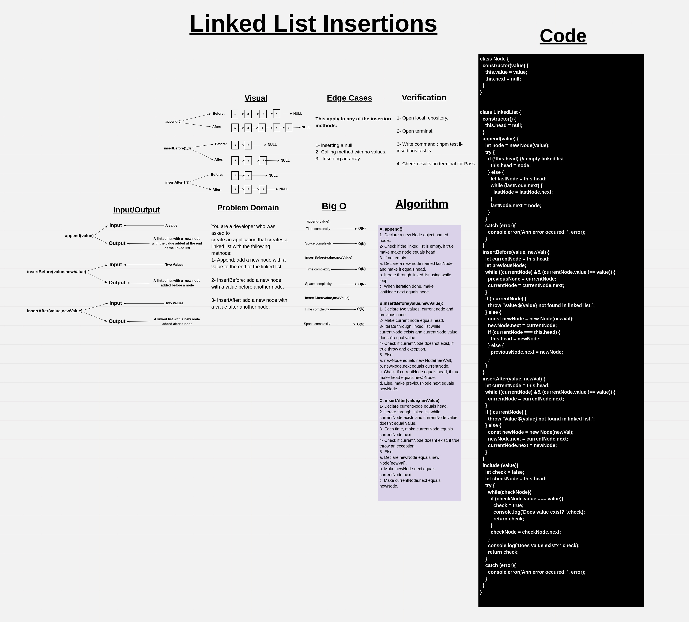

# Linked-list insertions

Inserting a new element into a singly linked list at beginning is quite simple. There are the following steps which need to be followed in order to inser a new node in the list at beginning. ... Allocate the space for the new node and store data into the data part of the node.

## Whiteboard Process

## Approach & Efficiency

BigO:

1. Append ->  Time: O(n).
              Space: O(n).

2. InsertBefore -> Time: O(n).
                   Space: O(n).

3. InsertAfter -> Time O(n).
                  Space: O(n).

## Solution

### Example

        let test = new LinkedList;
        
        test.append(1);
        test.append(2);
        test.append(3);

        test.insertBefore(3,5);
        test.insertAfter(3,6);

        console.log(test);
