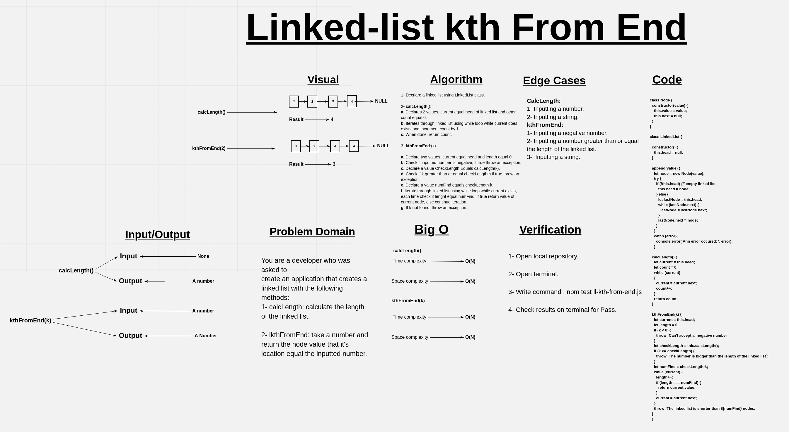

# ll-kth-from-end

Insert a number in the parameter and return the value of the node that it's location in the linkedlist equals the number, else throw an exception.

## Whiteboard Process

## Approach & Efficiency

BigO:

1. calcLength ->  Time: O(n).
                  Space: O(n).

2. kthFromEnd ->  Time: O(n).
                  Space: O(n).

## Solution

### Example

        let test = new LinkedList;
        
        test.append(1);
        test.append(2);
        test.append(3);

        test.calcLength());
        test.kthFromEnd(2);
