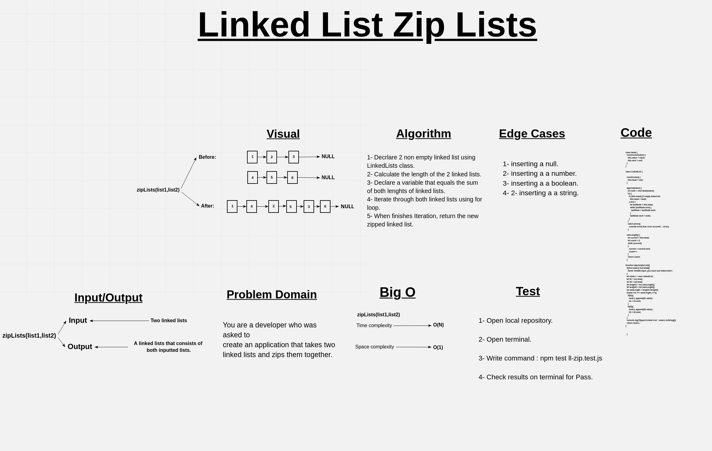

# Zip Lists

A function that accepts two linked lists, and combine them in one new linked list, if the inpute is not a linked lists, throw an exception.

## Whiteboard Process

## Approach & Efficiency

BigO:

1. ***calcLength*** ->  Time: O(n).
                        Space: O(n).

2. ***zipLists*** ->    Time: O(n).
                        Space: O(1).

## Solution

### Example

                let melon = new LinkedList;
                let waterMelon = new LinkedList;

                melon.append(1);
                melon.append(2);
                melon.append(3);
                waterMelon.append(4);
                waterMelon.append(5);
                waterMelon.append(6);

                console.log(melon.toString());
                console.log(waterMelon.toString());

                zipLists(melon,waterMelon);
