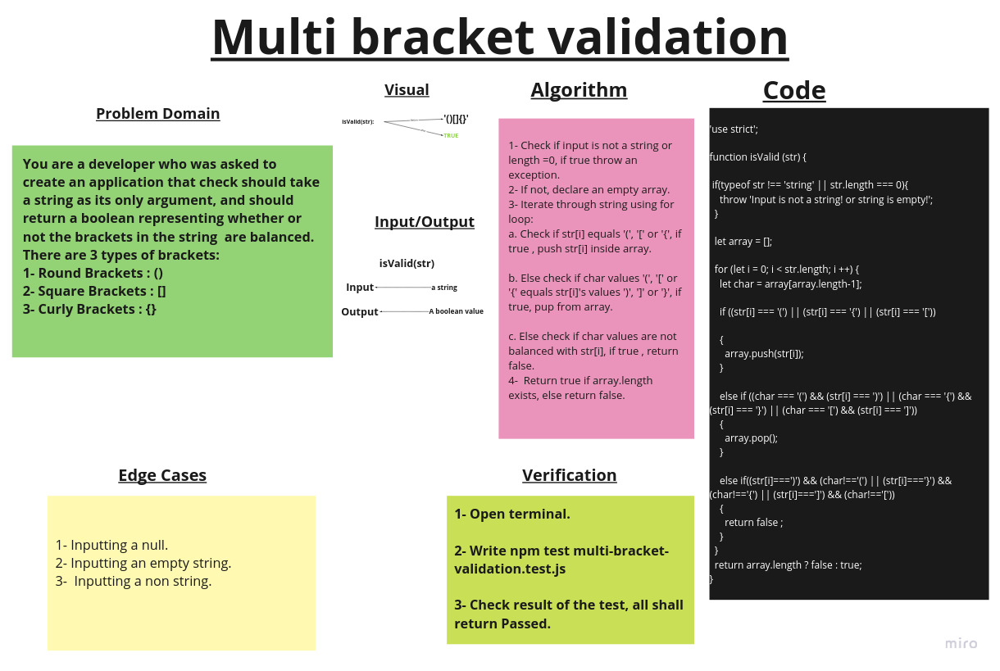

# Multi bracket validation

## Challenge Summary

A function that checks if a string is valid regarding brackets and braces ***((),{},[])*** , If it's valid, return **true** else return **false**.

## Whiteboard Process

## Approach & Efficiency

1. ***IsValid(stringValue)*** ->  Time: O(N).
                                  Space:O(N).

## Solution

### Example

    console.log(isValid('{}'));
    console.log(isValid('{}(){}'));
    console.log(isValid('()[[Extra Characters]]'));
    console.log(isValid('(){}[[]]'));
    console.log(isValid('{}{Code}[Fellows](())'));
    console.log(isValid('[({}]'));
    console.log(isValid('(]('));
    console.log(isValid('{(})'));
