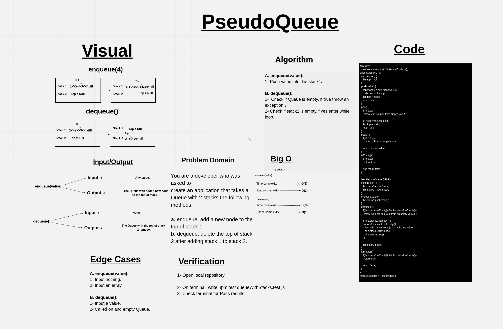

# Challenge Summary

Implement a first in first out (FIFO) queue using only two stacks. The implemented queue should support all the functions of a normal queue (push, peek, pop, and empty).

## Whiteboard Process

## Approach & Efficiency

1. ***enqueue(value)*** ->  Time: O(1).
                            Space: O(1).

2. ***dequeue()*** ->    Time: O(n).
                        Space: O(1).

## Solution

### Example

                let melon = new PesudoQueue;

                melon.enqueue(1);
                melon.enqueue(2);
                melon.enqueue(3);
                waterMelon.dequeue();

                console.log(melon.stack2.top.value);
