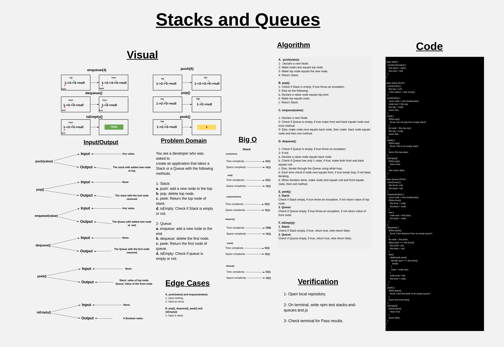

# Stacks and Queues

1. ***Stack:*** In computer science, a stack is an abstract data type that serves as a collection of elements, with two main principal operations: Push, which adds an element to the collection, and Pop, which removes the most recently added element that was not yet removed.

2. ***Queue:*** Queue is an abstract data structure, somewhat similar to Stacks. Unlike stacks, a queue is open at both its ends. One end is always used to insert data (enqueue) and the other is used to remove data (dequeue). ... A real-world example of queue can be a single-lane one-way road, where the vehicle enters first, exits first.

## Challenge

- Write Stack and Queue Classes with the following methods:

1. Stack:

- push(value): add a node to the top of stack.
- pop(): remove top ndoe from stack.
- peek(): return the value of top node in stack.
- isEmpty(): Check if stack empty.

2. Queue:

- enqueue(value): add a node to the end of queue.
- dequeue(): remove front node from queue.
- peek(): return the value of front node in queue.
- isEmpty(): Check if queue empty.

## Approach & Efficiency

#### BigO:

1. ***push(value)*** ->  Time: O(1).
                         Space: O(1).

2. ***pop()*** ->       Time: O(1).
                        Space: O(1).

3. ***enqueue(value)*** ->  Time: O(1).
                            Space: O(1).

4. ***dequeue()*** ->    Time: O(N).
                         Space: O(1).

5. ***peek()*** ->      Time: O(1).
                        Space: O(1).

6. ***isEmpty*** ->     Time: O(1).
                        Space: O(1).

## API

### Stack:

    - push(value): add a node to the top of stack.
    - pop(): remove top ndoe from stack.
    - peek(): return the value of top node in stack.
    - isEmpty(): Check if stack empty.

### Queue:

    - enqueue(value): add a node to the end of queue.
    - dequeue(): remove front node from queue.
    - peek(): return the value of front node in queue.
    - isEmpty(): Check if queue empty.

## Whiteboard

