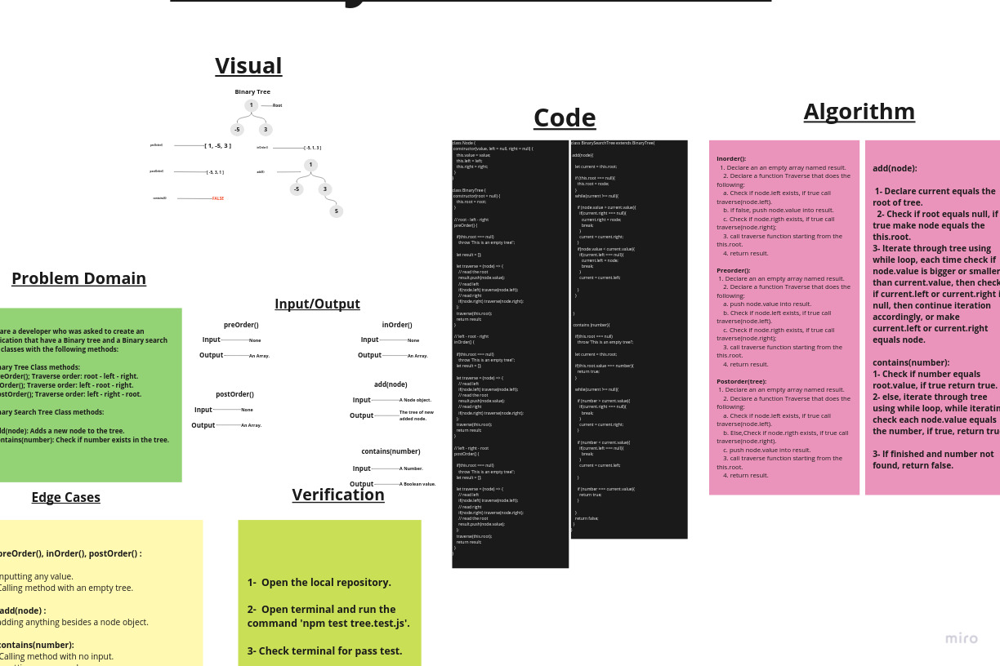

# Trees

A tree is a nonlinear data structure, compared to arrays, linked lists, stacks and queues which are linear data structures. A tree can be empty with no nodes or a tree is a structure consisting of one node called the root and zero or one or more subtrees.

A binary tree is a tree-type non-linear data structure with a maximum of two children for each parent. Every node in a binary tree has a left and right reference along with the data element. The node at the top of the hierarchy of a tree is called the root node.

## Challenge

1- Create a Node class.
2- Create a BinaryTree Class with 3 methods:

- preOrder();
***Traverse order: root - left - right***
- inOrder();
***Traverse order: left - root - right***
- postOrder();
***Traverse order: left - right - root***

3- Create a BinarySearchTree Class with 2 methods:

- add(node): Adds a new node to the tree.
- contains(number): Check if number exists in the tree.

## Approach & Efficiency

### BigO:

1. ***preOrder()*** ->  Time: O(N).
                        Space: O(N).

2. ***inOrder()*** ->   Time: O(N).
                        Space: O(N).

3. ***postOrder()*** ->  Time: O(N).
                         Space: O(N).

4. ***Aad(node)*** ->    Time: O(N).
                         Space: O(1).

5. ***contains(number)*** -> Time: O(N).
                             Space: O(1).

## API

1. preOrder();
***Traverse order: root - left - right***

2. inOrder();
***Traverse order: left - root - right***

3. postOrder();
***Traverse order: left - right - root***

4. add(node).
***Adds a new node to the tree.***

5. contains(number).
***Check if number exists in the tree.***

## Whiteboard

